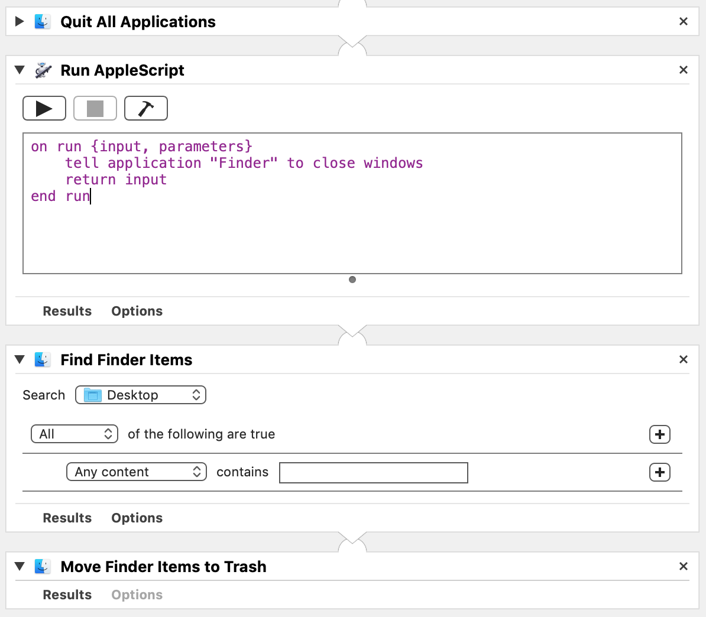
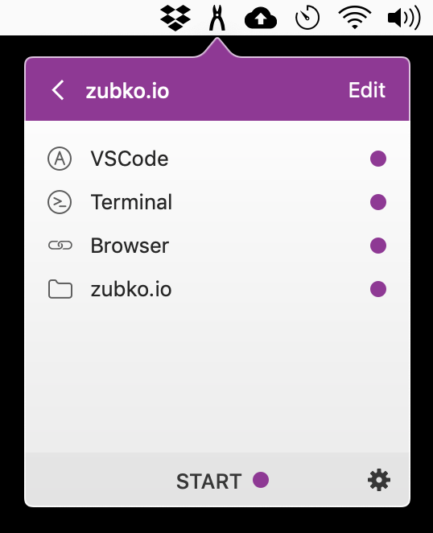

A tiny Automator script & an app to manage workspaces can work nicely together to declutter the virtual work space.

I usually touch a number of projects throughout a day and if I don't pay attention to clean up before I switch to the next project, the "leftovers" will start to pile up eating the laptop's resources and also adding to the total cognitive load.

And let's be honest, visiting every app and closing everything isn't the most interesting thing to do. So as with any mundane task the automation can come to the rescue! 🚀

The number of scripting choices is almost endless. I've chosen [Automator](https://support.apple.com/guide/automator/welcome/mac) because it can create and edit a script in a form of macOS app, so I can put it to the Applications folder and then call it quickly from the Spotlight. (And also because it seems kind of suited for these kind of things).

So with the mighty name `Quit All Apps` the script looks like this:

So it basically does 3 things:

* Closes all apps

* Closes all Finder windows (because they survive the 1st step)

* Removes everything from the Desktop (usually it's a bunch of recent screenshots)

Now I can breath-in / breath-out and with a fresh mind switch to another project.

### ... but wait, I don't want to reopen all the apps every time!

True, that can be actually one of the reasons to keep the old apps running.

Actually, this issue has a remedy as well! A tiny little app called [Workspaces](https://www.apptorium.com/workspaces). It's so convenient! And I'm sure its website will tell you much more.

Basically, I pre-create a list of what I will need for each project and then I quickly open it back any time. For example, for working on this website I open this list:

I really love this app! If there wasn't an app like that I'd write it myself. 😄