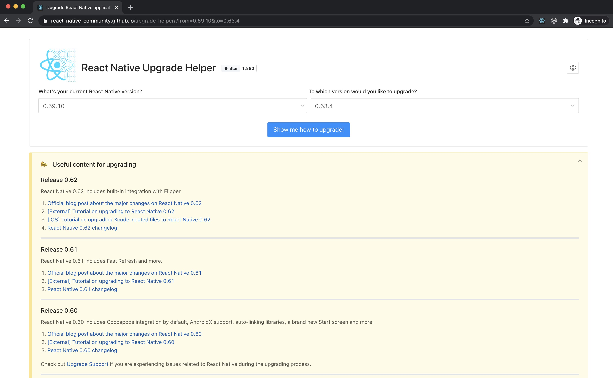
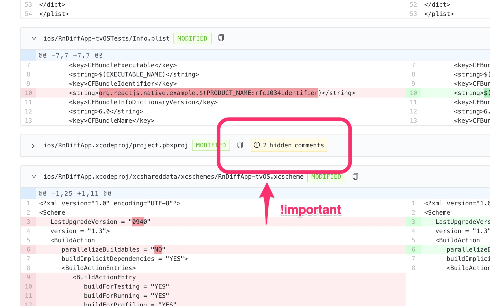
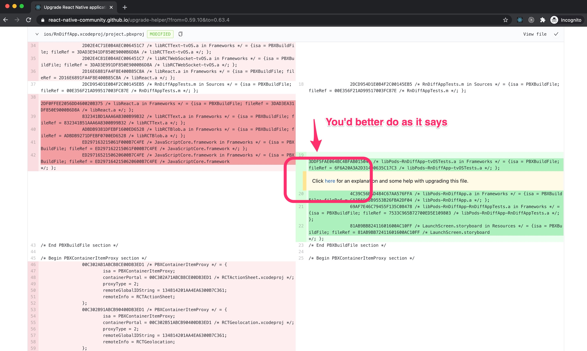

When upgrading React Native version of an existing app, it's important to check every small comment in the diff as if it's a document from a lawyer.

Currently to make an upgrade we have [a great project from RN community](https://react-native-community.github.io/upgrade-helper) to spot the differences between versions. The interface is straightforward. Choose the "from" and "to" versions, and see the release notes and code diff for the app:



I looked at the diffs, applied changes and everything went more or less smoothly, the Debug version was compiled without issues and I removed most of the native dependencies because now they were linked automatically. Eventually, fix by fix, the time came to make a Release build to send to the QAs. And there I've been stuck for almost half a day. The error came from the iOS build:

```
ld: library not found for -lBVLinearGradient
```

and a bunch of warnings for all dependencies comming from CocoaPods:

```
ld: warning: directory not found for option '-L/Users/runner/Library/Developer/Xcode/DerivedData/civimobile-aanaevheiyxooihigwacmgfqsmik/Build/Intermediates.noindex/ArchiveIntermediates/civimobile/BuildProductsPath/Release-iphoneos/BVLinearGradient'
ld: warning: directory not found for option '-L/Users/runner/Library/Developer/Xcode/DerivedData/civimobile-aanaevheiyxooihigwacmgfqsmik/Build/Intermediates.noindex/ArchiveIntermediates/civimobile/BuildProductsPath/Release-iphoneos/BugsnagReactNative'
ld: warning: directory not found for option '-L/Users/runner/Library/Developer/Xcode/DerivedData/civimobile-aanaevheiyxooihigwacmgfqsmik/Build/Intermediates.noindex/ArchiveIntermediates/civimobile/BuildProductsPath/Release-iphoneos/DoubleConversion'
...
```

And indeed, the folders were not there. Also, I noticed that the build is running too fast, and for some reason for the Release build the CocoaPods target was skipped, despite that the app target was using a build output of the CocoaPods target, which should have linked them. And for a long while, I was not able to find how to fix that connection.

Searching on the Internet also didn't help much, I've seen only a lot of questions without answers or when the libraries weren't found in general for the Debug build as well, which didn't apply to my case. Eventually, I started to think that I will have to create a new RN Xcode project and move the files and settings there.

Then I decided to give one more look at the diff, especially around the Xcode project files and I noticed that the collapsed section about the project has a notice about the comments inside. And this is actually very important:



To find the comments you have to open the section and check the diff of the project:



Which will lead to the Github issue: https://github.com/react-native-community/upgrade-support/issues/13

Which among other things will mention:

> Second, you need to do a project localization migration and **recommended settings update**

And that was exactly what was needed for my case! I was quite skeptical about it, but after Xcode applied the recommended settings the CocoaPods target started to be built before the main one, and in the Git diff of the project I noticed that a whole new Xcode scheme file was added to the Pods project folder.

The moral of this story is that during the RN version update every small step can be more important than we may think and it's important to read every comment in the diff.